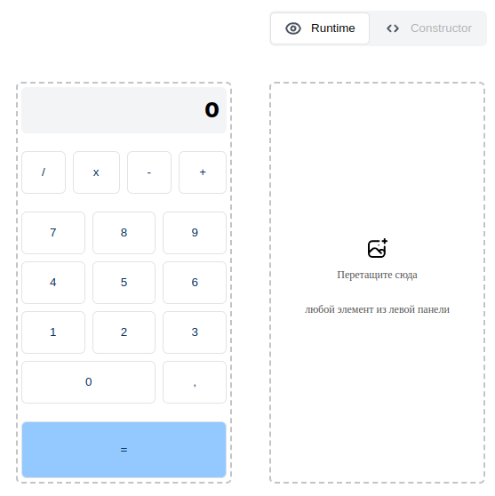

<h1 align="center">Dnd calculator</h1>
<h2 align="center">

[//]: # '[](https://github.com/vuejs/awesome-vue)'

</h2>

<p align="center">

[//]: # ''


</p>

[//]: # '<h2 align="center"><a  href="">Live Demo</a></h2>'
[//]: # '### [Contributions are Welcome](https://github.com/silent-lad/VueSolitaire/blob/master/CONTRIBUTING.md)'

## Description

**dnd calculator.**
<p align="center"></p>

[//]: # '<p align="center"></p>'

## About the project.

Simple calculator with drag and drop elements


## Technologies

**React**,
**Redux**,
**Redux-Toolkit**,
**TS**.

## Project setup

```
npm install
npm run serve
```

#### use yarn

```
yarn
yarn start
```

## Future scope

- type for drag events
- sortable elements (done)

## My Home Page

[Sergei Minko aka msaserj](https://msaserj.ru)
